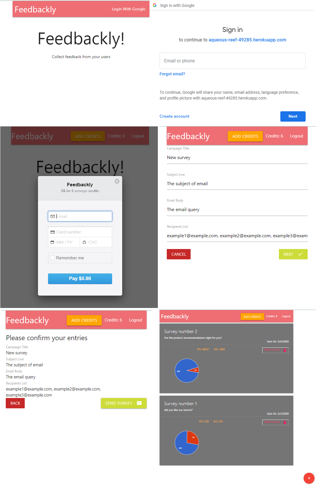

<h1>Feedbackly</h1>

This product is for project managers or project owners who want to get reviews from customers using their product. So the most basic  thing to do is send an email to your users and ask, "Are you satisfied with the use of the product?"
  And that's exactly what this project does!

<ul>
  <li>Sign up and log in to the site through your Google Account.</li>
  <li>Pay securely</li>
  <li>Creating surveys and sending them to hundreds and even thousands of emails.</li>
  <li>View the surveys you created and keep up to date with the results.</li>
</ul>

<h2>Quick Start:</h2>

<strong>Production version</strong>

There is a production version that is very simple to execute, just enter this link- https://aqueous-reef-49285.herokuapp.com/

<strong>Development Version</strong>

  <ol>
    <li>Duplicate the prod.js file in the /server/config folder and rename it to dev.js. Remove all values and leave only the keys.</li>
    <li>Create oauth credentials with google + api and extract googleClientID and googleClientSecret and place them in the dev.js file in the configuration: with the appropriate key (googleClientID, googleClientSecret).</li>
    <li>Create Database and Cluster in MongoDB Atlas, Copy the address under "Connection String Only"
You will need to replace <PASSWORD> with the database user's actual password created earlier when you paste into dev.js at the mongoURI key.</li>
    <li>Make up some random characters for cookieKey at dev.js.</li>
    <li>Create a user at https://stripe.com/ and Get your test API keys (Publishable key, Secret key) and place them in the appropriate places (stripePublishableKey, stripeSecretKey) in dev.js.</li>
    <li>Sign up for https://sendgrid.com/ and the API Key add to the dev.js file in the appropriate key (sendGridKey)</li>
    <li>In the keys.js file, update the redirectDomain key value to 'http: // localhost: 3000'.</li>
    <li>Run in cmd "ngrok http 5000" and the latest address starting with https should be pasted in Event Webhook on the Strip site.</li>
    <li>Finished, everything is ready. Run from cmd "npm run dev"</li>
  </ol>

<h2>Tecnolegis:</h2>

<ul>
  <li>NodeJS </li>
  <li>React</li>
  <li>Redux</li>
  <li>Express</li>
  <li>MongoDB</li>
</ul>

  <strong>Main packages</strong>

<ul>
  <li>mongoose: Communicate data from Mongo database to React application.</li>
  <li>react-router-dom: route user requests on the front</li>
  <li>express: route user requests on the backend</li>
  <li>redux-form: Build reusable user inputs</li>
  <li>stripe: Handle credit cards and receive payments from users</li>
  <li>cookie-session: Simple cookie-based session middleware.</li>
  <li>sendgrid: Allow quick integration between SendGrid and a project, SendGrid is a communication platform for transactional and marketing email. </li>
</ul>

